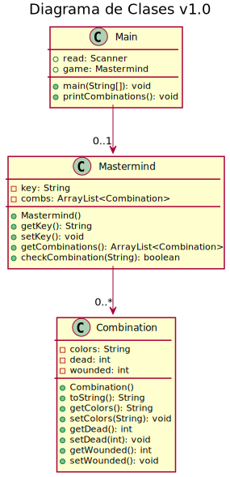
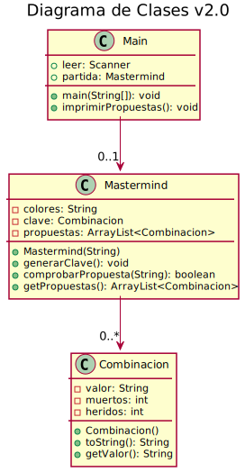
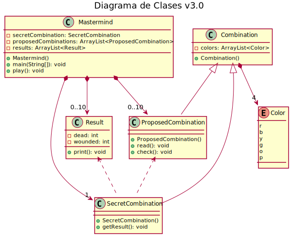
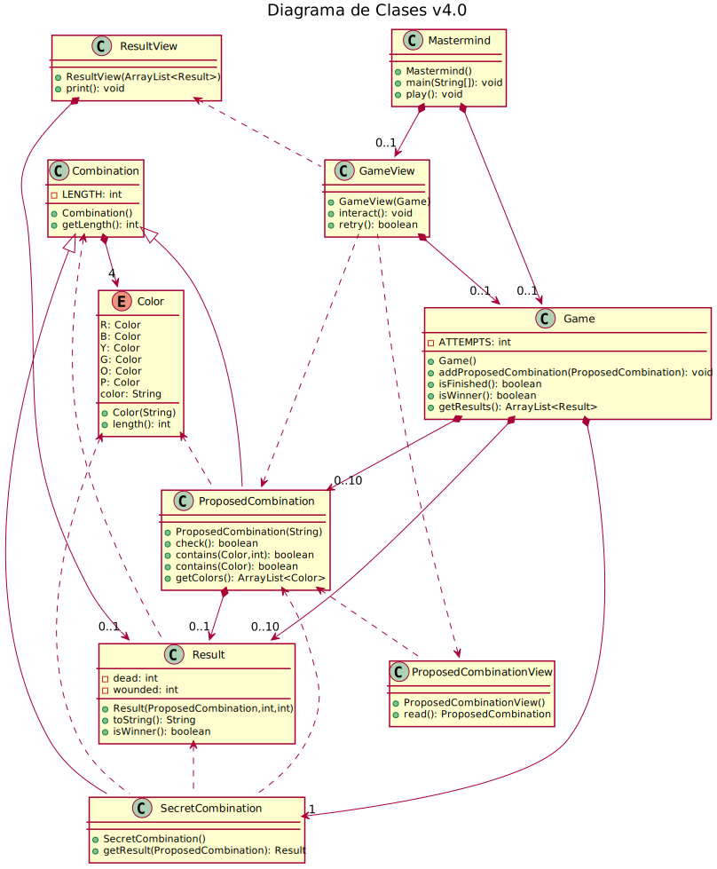

= Mastermind: Análisis y Diseño Orientado a Objetos

== Contenidos

1. link:#final-version[Versión final]
2. link:#final-version[Versiones anteriores]

[#final-version]
== Versión final

El diagrama de la link:#diagram-class5[Figura {counter:figure}] representa el diseño estructural que ha sido decidido para la implementación del juego.
La última versión de este software ha sido obtenida como resultado de realizar una serie de propuestas y mejoras continuas, trabajando en los errores que se han ido producido durante el análisis y diseño.
La solución se ha basado en las leyes y principios que se han aprendido en este período.

En las link:#previous-versions[versiones anteriores] veremos brevemente cómo de un diseño muy poco mantenible, se ha obtenido este diseño fluido, flexible, fuerte y reusable.

[#diagram-class5]
image::Resources/diagram-class5.svg[caption="Figura {counter:figure}. ",title="Diagrama de clases versión final.",align="center"]

[#previous-versions]
== Versiones anteriores

En la link:#diagram-class1[primera versión] del diseño no se cumplió ninguna de las características deseables en términos de mantenibilidad.
En líneas generales, el problema principal fue que el diseño no había sido modularizado lo suficiente, y esto lo hacía un diseño rígido y viscoso, que dificulta la realización de cambios.
Por esta misma razón, tampoco era reusable.
También se observaron problemas con la legibilidad, ya que se utilizaron nombres que daban lugar a ambigüedad, y además existía gran cantidad de código muerto.

[#diagram-class1]

En la link:#diagram-class2[segunda versión], se siguió por la misma línea.
Se realizaron una serie de cambios que no resultaron ser útiles, excepto la eliminación del código muerto.

[#diagram-class2]

En la link:#diagram-class3[tercera versión] ya se puede ver cómo se mejora la fluidez, la flexibilidad y la reusabilidad del diseño gracias a un trabajo más exhaustivo sobre el modelo de dominio.
La modularización permitió llevar a cabo una distribución de responsabilidades más equilibrada.
También se ha mejorado la legibilidad, los atributos y los métodos se nombraron a corde con los estándares.

[#diagram-class3]

En la link:#diagram-class4[cuarta versión] se aplicó una aproximación previa al patrón MVC, lo que permitió modularizar aún más el diseño.
De esta forma, se aumentó la cohesión aplicando el Principio de Única Responsabilidad, la Separación de Asuntos y eliminando Código Sucio por Envidia de Características.
Además, se redujeron el tamaño y la complejidad de clases y métodos.

[#diagram-class4]

La link:#diagram-class5[versión final] trata de mejorar los aspectos que quedaron sueltos en la
link:#diagram-class4[cuarta versión].
Por ello, se añaden más vistas y controladores que mejoran el acoplamiento con el resto de clases.